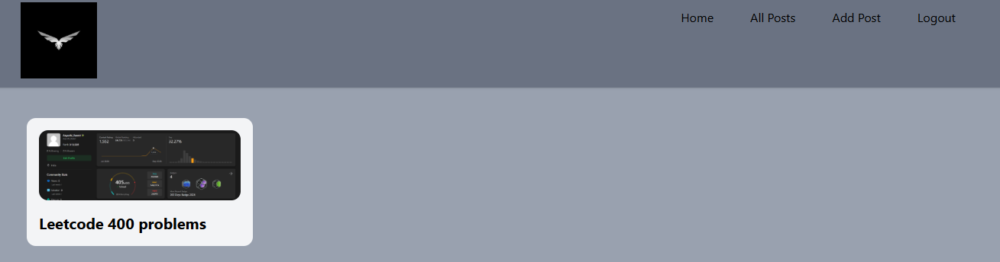
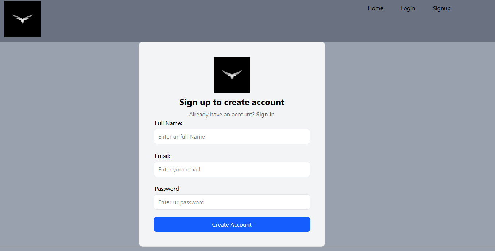
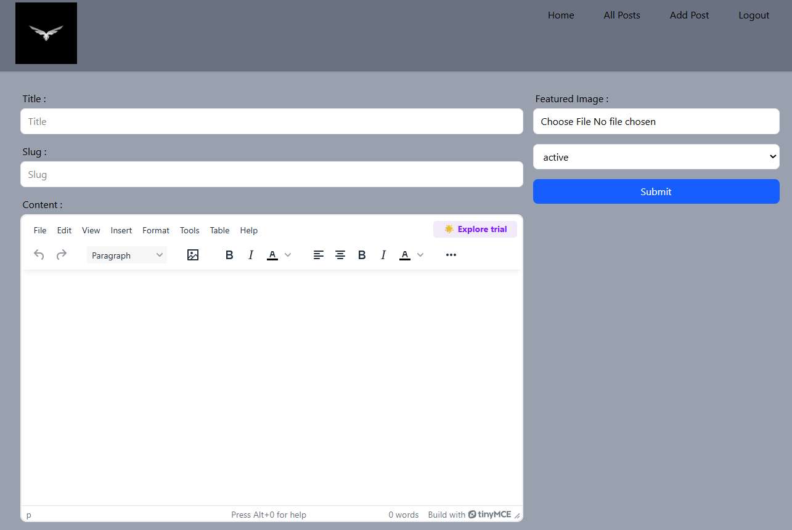
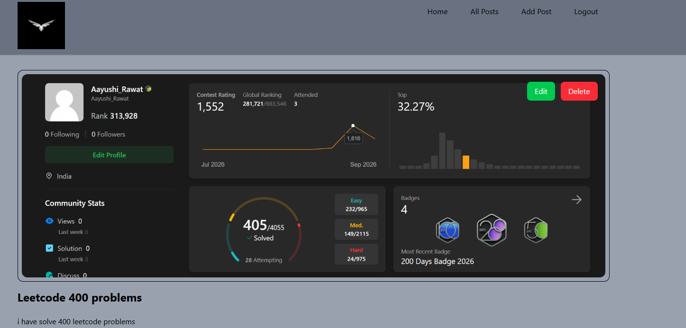

# 📝 React Blog App

A full-stack blog application built with **React.js, Vite, Redux Toolkit, and Appwrite**. Users can create an account, publish and manage blog posts, upload featured images, and read posts through a clean, responsive interface.

## 🚀 Features

* 🔐 User authentication with Appwrite
* 📝 Create, edit, and delete blog posts
* ✍️ Rich-text editing with TinyMCE
* 🖼️ Image upload and preview using Appwrite Storage
* 🛡️ Protected routes for authenticated users
* 🗃️ Appwrite database integration
* 🔄 Global state management with Redux Toolkit
* 📱 Responsive UI with Tailwind CSS

## 🛠️ Tech Stack

**Frontend:** React.js, JavaScript, Vite, Tailwind CSS
**State Management:** Redux Toolkit
**Routing:** React Router DOM
**Backend:** Appwrite
**Editor:** TinyMCE
**Forms:** React Hook Form

## 📂 Project Structure

```text
src/
├── appwrite/       # Appwrite services
├── components/     # Reusable components
├── pages/          # Application pages
├── store/          # Redux state
├── conf/           # Configuration
├── App.jsx
└── main.jsx
```

## ⚙️ Installation

```bash
git clone <your-repository-url>
cd React-Blog-App
npm install
npm run dev
```

Create a `.env` file and add your Appwrite and TinyMCE configuration:

```env
VITE_APPWRITE_URL=your_appwrite_url
VITE_APPWRITE_PROJECT_ID=your_project_id
VITE_APPWRITE_DATABASE_ID=your_database_id
VITE_APPWRITE_COLLECTION_ID=your_collection_id
VITE_APPWRITE_BUCKET_ID=your_bucket_id
VITE_TINYMCE_API_KEY=your_api_key
```

## 📸 Screenshots

### Home Page



### Login Page


### Signup Page


### Add Posts



### Edit Post



## 🌐 Live Demo

**Live:** `Add your deployed link here`

## 👩‍💻 Author

**Aayushi Rawat**

* GitHub: https://github.com/aayushi1403
* LinkedIn: https://www.linkedin.com/in/aayushi-rawat-software-developer/

⭐ If you found this project useful, consider giving it a star!

